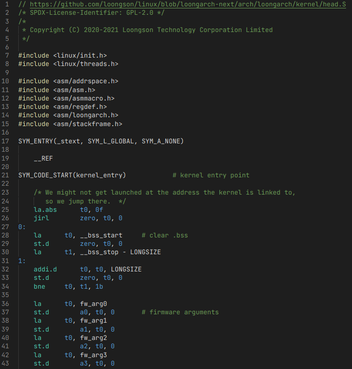
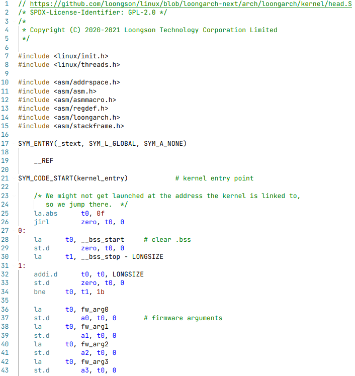

# LoongArch Assembly

An extension that provides language support for LoongArch assembly language.

## Features

Provide syntax highlighting for LoongArch assembly language.

Screenshot:

* Color theme: Dark+


* Color theme: Light+


## Requirements

```bash
# Install js-yaml as a development only dependency in your extension
$ npm install js-yaml --save-dev

# Use the command-line tool to convert the yaml grammar to json
$ npx js-yaml syntaxes/loongarch.tmLanguage.yaml > syntaxes/loongarch.tmLanguage.json
```

## Known Issues

* Comments starting with `#` must be followed by a whitespace character in order to be highlighted correctly.
* Highlighting of rarely used symbols may be missing or redundant.

## Release Notes

### 1.0.0

Initial release of loongarch-assembly.

Added syntax highlighting for LoongArch assembly language.

## Reference

* [Vscode Language Extensions, Syntax Highlight Guide](https://code.visualstudio.com/api/language-extensions/syntax-highlight-guide)
* [Language Grammars, Naming Conventions](https://macromates.com/manual/en/language_grammars#naming_conventions)
* [Regular Expressions](https://raw.githubusercontent.com/kkos/oniguruma/master/doc/RE)
* [LoongArch Opcodes](https://github.com/loongson/binutils-gdb/blob/loongarch-2_37/opcodes/loongarch-opc.c)
* [Assembler Directives](https://sourceware.org/binutils/docs/as/Pseudo-Ops.html#Pseudo-Ops)
* [Directives](https://gcc.gnu.org/onlinedocs/cpp/Index-of-Directives.html#Index-of-Directives_fn_symbol-1)
* [Test File](https://github.com/loongson/linux/blob/loongarch-next/arch/loongarch/kernel/head.S)
